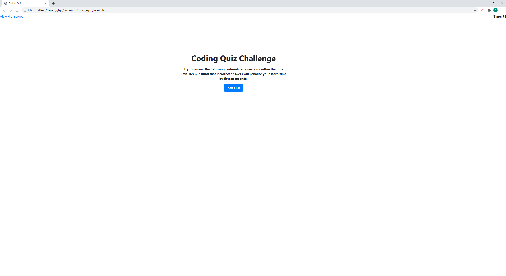
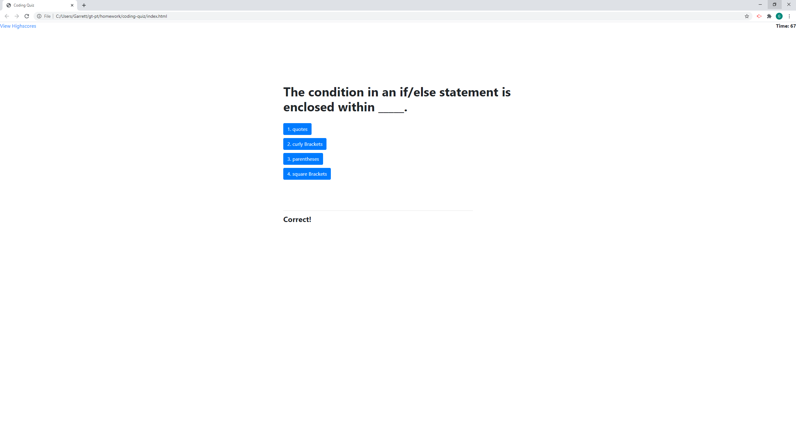
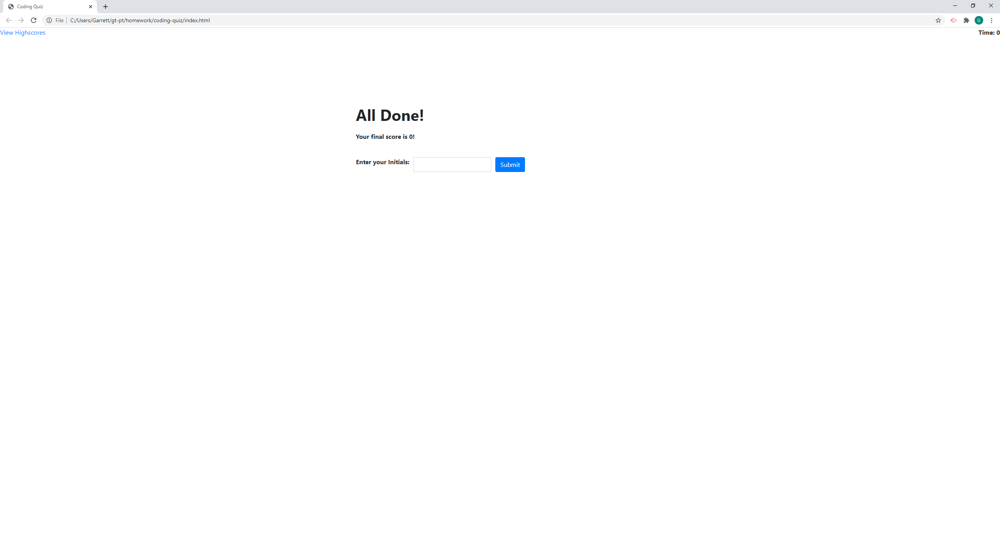

# Coding Quiz

## Description

A five question quiz on basic coding knowledge. Try to get the high score!

## Usage
Press the start button to begin the quiz. Once started, a timer will tick down, starting at 75. You can track the time at the top right of the screen. Be careful, if you get a question incorrect and you will lose 15 seconds. 
After answering all 5 questions, or if the timer hits 0, your time remaining will be your final score and you will be asked to input your initials. Upon entering your initials, you will taken to the high score screen and you can
view the highest scores saved in the local storage of your browser!

## Website Link
[Coding Quiz](https://rgl10d.github.io/coding-quiz/)

## License
MIT License

Copyright © [2020] [Garrett Lee]

Permission is hereby granted, free of charge, to any person obtaining a copy
of this software and associated documentation files (the "Software"), to deal
in the Software without restriction, including without limitation the rights
to use, copy, modify, merge, publish, distribute, sublicense, and/or sell
copies of the Software, and to permit persons to whom the Software is
furnished to do so, subject to the following conditions:

The above copyright notice and this permission notice shall be included in all
copies or substantial portions of the Software.

THE SOFTWARE IS PROVIDED "AS IS", WITHOUT WARRANTY OF ANY KIND, EXPRESS OR
IMPLIED, INCLUDING BUT NOT LIMITED TO THE WARRANTIES OF MERCHANTABILITY,
FITNESS FOR A PARTICULAR PURPOSE AND NONINFRINGEMENT. IN NO EVENT SHALL THE
AUTHORS OR COPYRIGHT HOLDERS BE LIABLE FOR ANY CLAIM, DAMAGES OR OTHER
LIABILITY, WHETHER IN AN ACTION OF CONTRACT, TORT OR OTHERWISE, ARISING FROM,
OUT OF OR IN CONNECTION WITH THE SOFTWARE OR THE USE OR OTHER DEALINGS IN THE
SOFTWARE.

